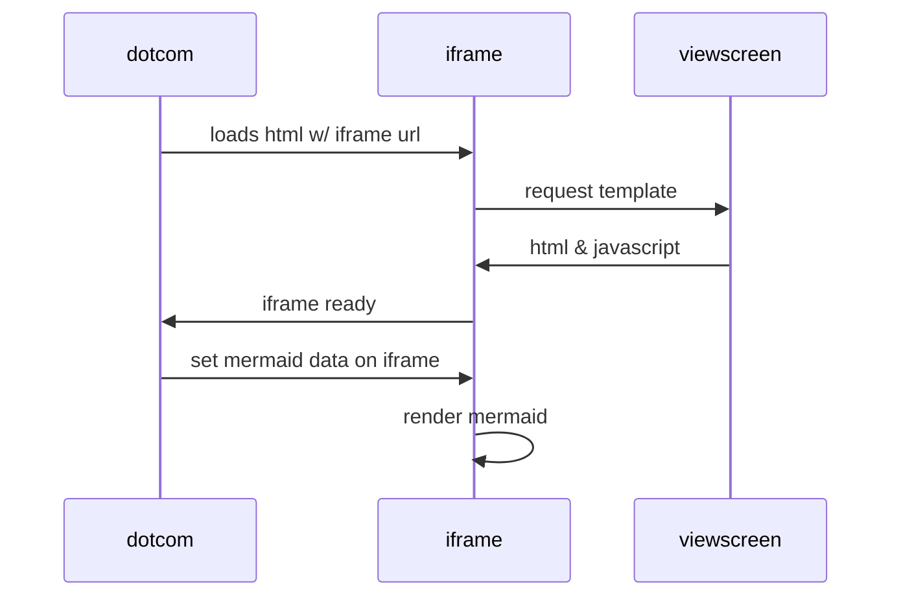
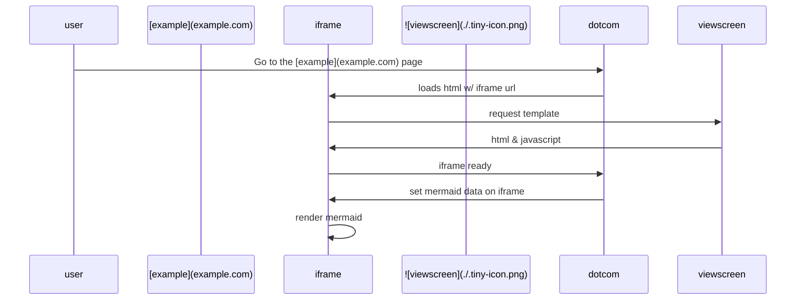
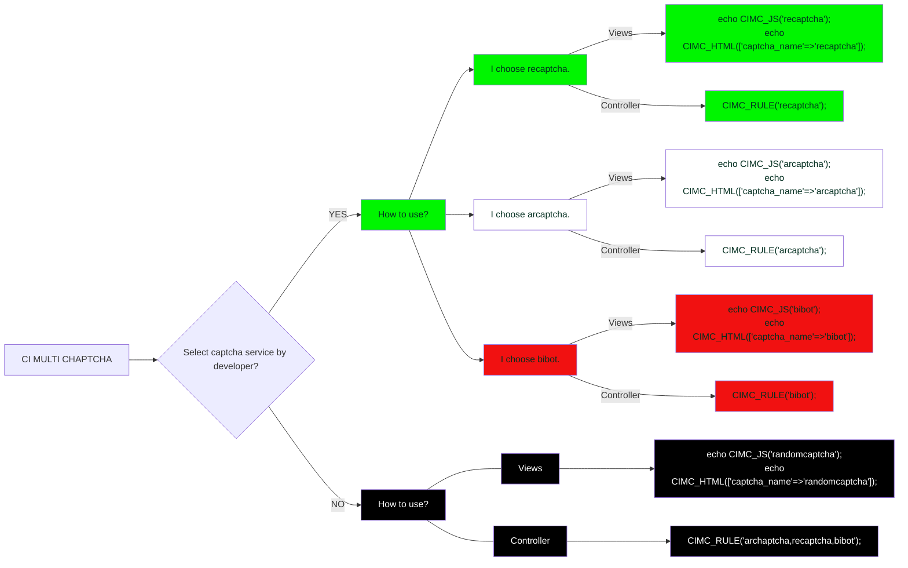
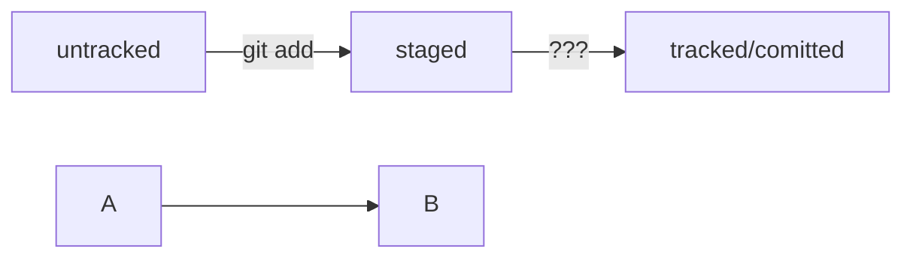

# Заголовок 1
## Заголовок 2
### Заголовок 3
#### Заголовок4
##### Заголовок5
###### Заголовок 6

Заголовок 1
============

Заголовок 2
------------
  
Баскетбол
*Баскетбол*  
_Баскетбол_
**Баскетбол**  
__Баскетбол__
**Баскетбол и _Баскетбол_**
~~Баскетбол~~

-[] Шпаргалка по Markdown  
-[x] Шпаргалка по Markdown

1. Баскетбол
2. Баскетбол  
..* Баскетбол  
... Баскетбол  

  Баскетбол
  
[Баскетбол](https://www.Баскетбол)
`Баскетбол` b `Баскетбол`

```python
s = "Подсветка Python"
print s
```

| Баскетбол | Баскетбол |  Баскетбол| 
| --------- |:---------:| ---------:|
| *Баскетбол | `Баскетбол` | **Баскетбол** | 

> Баскетбол
> Баскетбол
>> Шпаргалка по Markdown
>>> Шпаргалка по Markdown

> БаскетболБаскетбол

---
***
___

Баскетбол  Баскетбол
Баскетбол
Баскетбол

Баскетбол

1. Шпаргалка по Markdown
	1. Шпаргалка по Markdown	
		1. Шпаргалка по Markdown
			1. Шпаргалка по Markdown  

. Шпаргалка по Markdown
	. Шпаргалка по Markdown
		. Шпаргалка по Markdown
		
		
- Шпаргалка по Markdown
	-[] Шпаргалка по Markdown
	-[x] Шпаргалка по Markdown

- Шпаргалка по Markdown:
	> Шпаргалка по Markdown
	
<https://.Шпаргалка.ru>


Шпаргалка по Markdown|Шпаргалка по Markdown|Шпаргалка по Markdown
:-|-|-:
Шпаргалка по Markdown   |    Шпаргалка по Markdown    |    Шпаргалка по Markdown    

`Шпаргалка по Markdown`

|| Шпаргалка по Markdown ||










